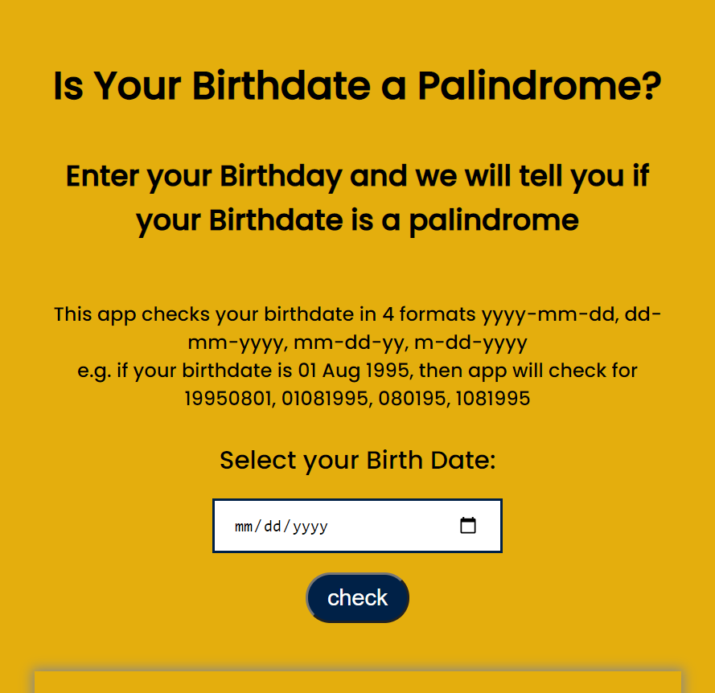

<h1 align="center">Is your Birthdate Palindrome🤔?</h1>

<p align="center"><font size="4">Is Your Birthdate a palindrome? Check it out then!!</font></p>

<h1 align="center">Links🌐</h1>

<h2 align="center">Check out this App <a href="https://dev-birthdate-palindrome.netlify.app/">here</a>!🚀</h2>

<h1 align="center">Images/Screenshots</h1>

<p align="center">

</p>

## 🛠️ Installation Steps

1. Clone the repository

```Bash
git clone https://github.com/Devansu-Yadav/Birthday-Palindrome.git
```

2. Change the working directory

```Bash
cd Birthday-Palindrome/
```

3. Run the app locally using the <b>Go Live Extension</b> on <b>VS Code</b>

## 👷 Built with

- HTML
- CSS
- Vanillajs